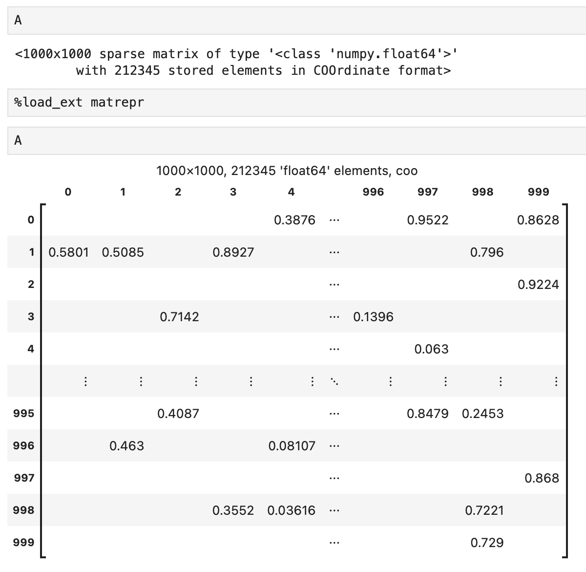

[](https://github.com/alugowski/matrepr/actions/workflows/tests.yml)
[](https://codecov.io/gh/alugowski/matrepr)
[](https://pypi.org/project/matrepr/)

# MatRepr

Sparse matrix HTML and LaTeX representation with Jupyter integration. For Spy plots see [MatSpy](https://github.com/alugowski/matspy).

Supports:
* `scipy.sparse` sparse matrices and arrays like `csr_matrix` and `coo_array`.
* `python-graphblas` sparse matrices and vectors
* `list`, `tuple`

```shell
pip install matrepr
```

## Purpose

Turn this opaque string:
```
<1000x1000 sparse matrix of type '<class 'numpy.float64'>'
	with 212345 stored elements in COOrdinate format>
```

To one of these:

### HTML


`mdisplay(A)`, or simply `A` if Jupyter integration enabled. Use `to_html()` for raw HTML string.

### LaTeX


`mdisplay(A, 'latex')`, or simply `A` if LaTeX version of Jupyter integration enabled. Use `to_latex()` for raw LaTeX string.


## Quick Start

```shell
pip install matrepr
```

```python
from matrepr import mdisplay
```

* `mdisplay(A)`: Displays the output of `to_html` or `to_latex` in Jupyter.
* `to_html(A)`: Format `A` as an HTML table. Returns a string.
* `to_latex(A)`: Format `A` as a LaTeX matrix. Returns a string.

## Jupyter Integration

MatRepr can integrate with [Jupyter's formatter](https://ipython.readthedocs.io/en/stable/config/integrating.html)
to automatically format supported sparse matrix types. Simply import `matrepr.jupyter` to register MatRepr's formatter
with Jupyter.

```python
import matrepr.jupyter
```



If you prefer LaTeX:
```python
import matrepr.jupyter_latex
```

## Arguments

All methods take the same arguments. Apart from the matrix itself:

* `title`: string label. If `True`, then a matrix description is auto generated that contains matrix shape, number and type of nonzeros, etc.
* `indices`: Whether to show matrix indices.
* `max_rows`, `max_rows`: size of table. Matrices larger than this are truncated with ellipses.
* `precision`: floating-point precision
* `num_after_dots`: How many rows/columns to show from the end of the matrix if the entire matrix does not fit.

### Overriding defaults
`matrepr.params` contains the default values for all arguments.

For example, to always disable the title, disable indices, and only show the top-left part of the matrix:

```python
matrepr.params.title = False
matrepr.params.indices = False
matrepr.params.num_after_dots = 0
```

## Edge Cases

MatRepr gracefully handles:
 * multiple elements with the same coordinates (i.e. duplicates)
 * nested matrices
 * complex values
 * string values (including multiline)
 * LaTeX scientific notation as $`\times 10^{power}`$

See [demo-edgecases notebook](doc/demo-edgecases.ipynb) for more.

## How does it work?

Each package that MatRepr supports implements two classes:

* `Driver`: Declares what types are supported and supplies an adapter.
  * `get_supported_types`: This declares what types are supported, as strings to avoid unnecessary imports.
  * `adapt(A)`: Returns a `MatrixAdapter` for a matrix that this driver supports.
* `MatrixAdapter`. A common interface for extracting relevant matrix data. MatRepr supports three kinds:
  * `MatrixAdapterRow`: is able to efficiently read a selected row.
  * `MatrixAdapterCol`: is able to efficiently read a selected column.
  * `MatrixAdapterCoo`: is able to extract a portion of the matrix as tuples.

See [matrepr/adapters](matrepr/adapters) for details.

You may use `matspy.register_driver` to register a Driver for your own matrix class.