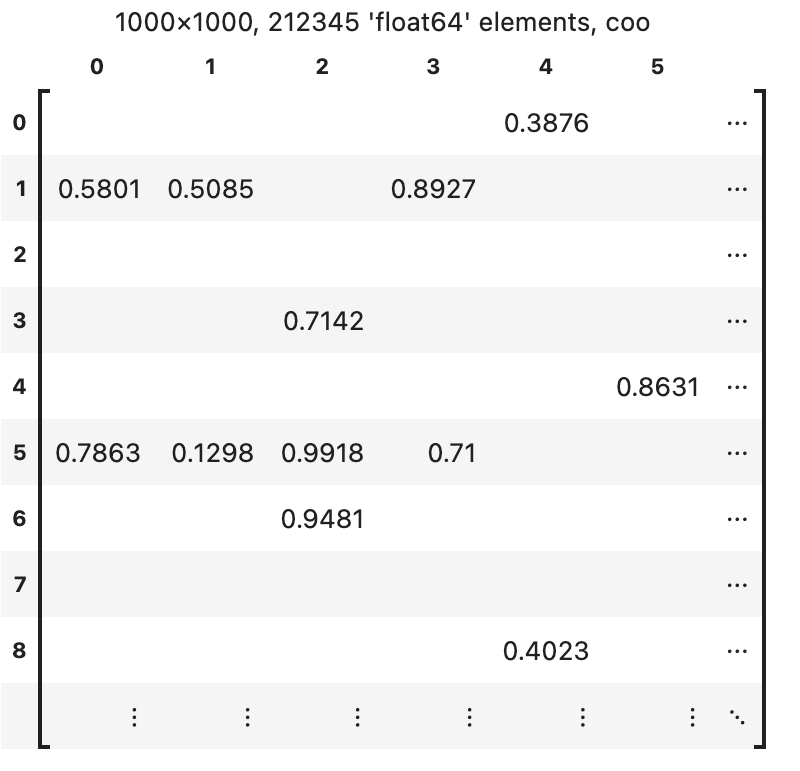
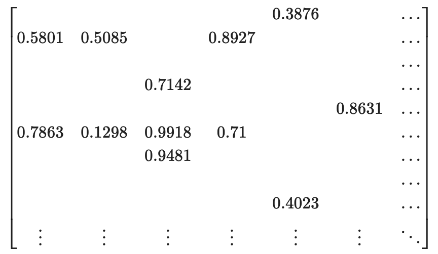

[](https://github.com/alugowski/matrepr/actions/workflows/tests.yml)
[](https://codecov.io/gh/alugowski/matrepr)
[](https://pypi.org/project/matrepr/)

# MatRepr

```shell
pip install matrepr
```

Sparse matrix string, HTML, and LaTeX representation with Jupyter integration.

* **SciPy** - sparse matrices and arrays like `csr_matrix` and `coo_array`
* **[Python-graphblas](https://github.com/python-graphblas/python-graphblas)** - `gb.Matrix` and `gb.Vector` [(demo)](doc/demo-python-graphblas.ipynb)
* **[PyData/Sparse](https://sparse.pydata.org/)** - `COO`, `DOK`, `GCXS` [(demo)](doc/demo-pydata-sparse.ipynb)
* **NumPy** - `ndarray`
* `list`, `tuple`, including multi-dimensional and jagged

Features:
* Jupyter extension to format matrices in cell outputs.
* A `__repr__` monkey patch to format matrices in the Python shell.
* Nested sub-matrices of any supported type, including mixing packages.
* Configurable float precision or format string.
* Toggle row and column indices or set your own labels.
* Toggle matrix description or set your own title.
* String output can optionally autodetect terminal width.
* Methods to directly display a matrix (`mprint`, `mdisplay` for Jupyter)
* Methods to convert to string (`to_html`, `to_latex`, `to_str`).
* Configurable per method call or set defaults with `matrepr.params`.
* Fast.

See [Jupyter notebook with examples.](doc/demo.ipynb)

### String

```
1000×1000, 212345 'float64' elements, coo
      0        1        2        3        4        5        6
  ┌                                                                    ┐
0 │                                     0.3876                     ... │
1 │ 0.5801   0.5085            0.8927                     0.629    ... │
2 │                                                                ... │
3 │                   0.7142                                       ... │
4 │                                              0.8631            ... │
5 │ 0.7863   0.1298   0.9918    0.71                      0.3444   ... │
6 │                   0.9481                                       ... │
7 │                                                       0.1679   ... │
8 │                                     0.4023                     ... │
  │   :        :        :        :        :        :        :      ... │
  └                                                                    ┘
```

`mprint(A)`, `to_str(A)`  
or simply `A` with monkey patching as below

### HTML


`mdisplay(A)`, `to_html(A)`  
or simply `A` with Jupyter extension `%load_ext matrepr`

### LaTeX


`mdisplay(A, 'latex')`, `to_latex(A)`  
or simply `A` with Jupyter extension `%load_ext matrepr.latex`

**Note:** For Spy plots see [MatSpy](https://github.com/alugowski/matspy).

## Quick Start

```shell
pip install matrepr
```

```python
from matrepr import mdisplay
```

Methods:
* `to_str(A)`: Format `A` as string.
* `to_html(A)`: Format `A` as an HTML table. Returns a string.
* `to_latex(A)`: Format `A` as a LaTeX matrix. Returns a string.
* `mprint(A)`: print `A` as a string to stdout.
* `mdisplay(A)`: Displays the output of `to_html`, `to_latex`, or `to_str` in Jupyter.

## Jupyter Extension

MatRepr's Jupyter extension registers with [Jupyter's formatter](https://ipython.readthedocs.io/en/stable/config/integrating.html)
to format supported matrices with MatRepr. Simply:

```jupyter
%load_ext matrepr
```

Or if you prefer LaTeX:
```jupyter
%load_ext matrepr.latex
```

Example:


## Interactive Python: Monkey Patching `__repr__`

The interactive Python REPL does not have a nice way to register a formatter.

We can monkey patch a `__repl__` method into supported matrix classes for a similar effect.

This is implemented in the [matrepr.patch](matrepr/patch) module. Simply import the patch you want:

* `import matrepr.patch.scipy`
* `import matrepr.patch.graphblas`
* `import matrepr.patch.sparse`

Example:

```
>>> a = scipy.sparse.random(4, 4, density=0.5)
>>> a
<4x4 sparse matrix of type '<class 'numpy.float64'>'
	with 8 stored elements in COOrdinate format>
>>> import matrepr.patch.scipy
>>> a
4×4, 8 'float64' elements, coo
        0        1        2        3
    ┌                                   ┐
  0 │ 0.4016                     0.4412 │
  1 │ 0.309    0.8055                   │
  2 │                   0.1982          │
  3 │ 0.7438   0.6938            0.2215 │
    └                                   ┘
```

## Arguments

All methods take the same arguments. Apart from the matrix itself:

* `title`: string label. If `True`, then a matrix description is auto generated that contains matrix shape, number and type of nonzeros, etc.
* `indices`: Whether to show matrix indices.
* `max_rows`, `max_rows`: size of table. Matrices larger than this are truncated with ellipses.
* `precision`: floating-point precision
* `num_after_dots`: How many rows/columns to show from the end of the matrix if the entire matrix does not fit.

### Overriding defaults
`matrepr.params` contains the default values for all arguments.

For example, to always disable the title, disable indices, and only show the top-left part of the matrix:

```python
matrepr.params.title = False
matrepr.params.indices = False
matrepr.params.num_after_dots = 0
```

## Edge Cases

MatRepr gracefully handles:
 * multiple elements with the same coordinates (i.e. duplicates)
 * nested matrices
 * complex values
 * string values (including multiline)
 * LaTeX scientific notation as $`\times 10^{power}`$

See [demo-edgecases notebook](doc/demo-edgecases.ipynb) for more.

## How does it work?

Each package that MatRepr supports implements two classes:

* `Driver`: Declares what types are supported and supplies an adapter.
  * `get_supported_types`: This declares what types are supported, as strings to avoid unnecessary imports.
  * `adapt(A)`: Returns a `MatrixAdapter` for a matrix that this driver supports.
* Implement any of these `MatrixAdapter` classes:
  * `MatrixAdapterRow`: for structs able to efficiently read a selected row.
  * `MatrixAdapterCol`: for structs able to efficiently read a selected column.
  * `MatrixAdapterCoo`: for structs able to extract a portion of the matrix as tuples.

See [matrepr/adapters](matrepr/adapters) for details.

You may use `matspy.register_driver` to register a Driver for your own matrix class.